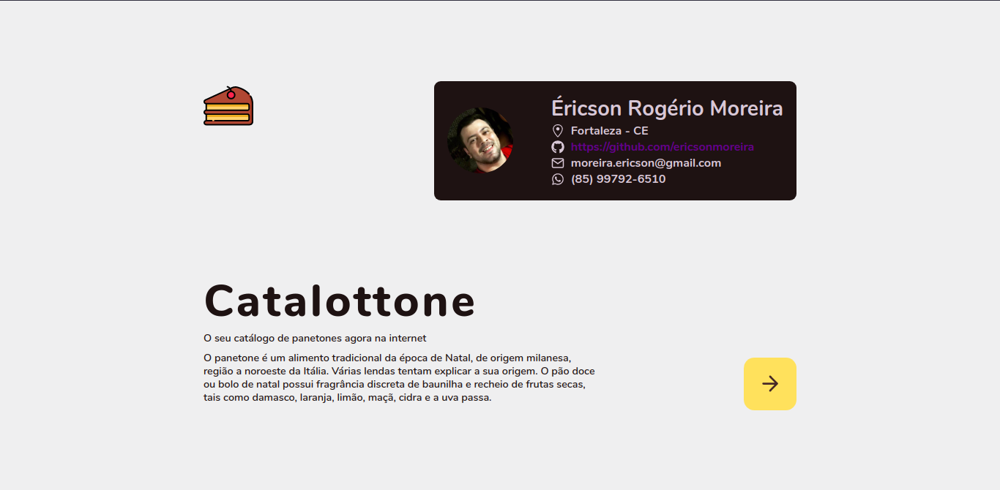
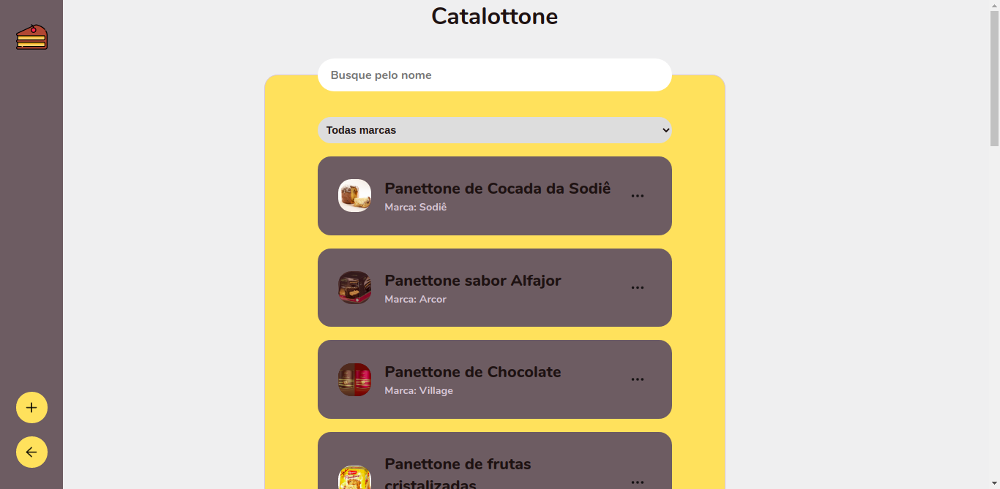
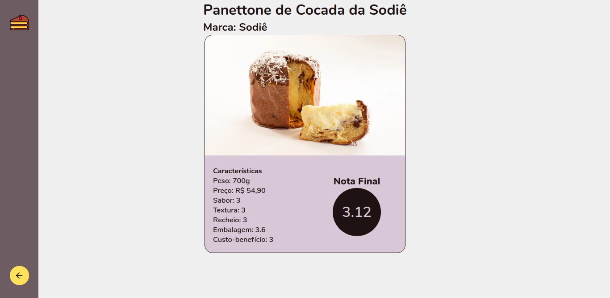
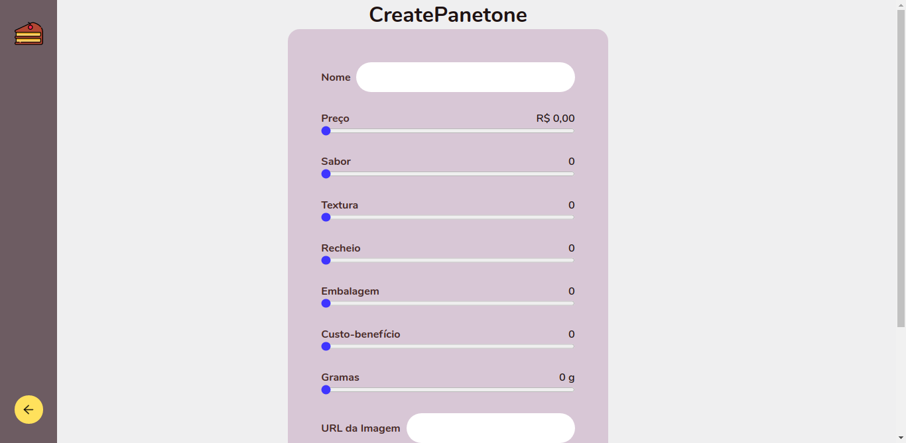

# FFIT - Processo seletivo

Esse projeto consiste no desenvolvimento de uma aplicação que simula um **"Catálogo de Panetones"**.

## Catalottone - Seu Catálogo de Panetones

Nomeamos essa aplicação de **Catalottone**, fazendo assim uma alusçào a combinação das palavras _catálogo_ e _panetone_. Todos os dados fictícios foram obtidos dessa [referência](https://www.huffpostbrasil.com/entry/os-melhores-panettones-natal_br_5dfd0382e4b05b08bab4fd7b).

## Requisitos funcionais

1. Uma tela explicando o que é um panetone.
2. Uma lista de panetones de algumas marcas (Bauducco, Nestlé, etc) com fotos (dos panetones) e com filtro (pelo menos filtrar por marca).
3. Tela de detalhamento contendo informações detalhadas do panetone selecionado (ex: peso, informações nutricionais, preço - esses dados podem ser totalmente fictícios).

## Requisitos não funcionais

1. O código deve ser feito utilizando ReactJS ou React Native (Javascript ou Typescript).
2. O código deve ser disponibilizado através de um repositório de código fonte (bitbucket, github ou gitlab).

## O que foi usado

- Linguagem base: [TypeScript](https://www.typescriptlang.org/).
- Framework: [ReactJS](https://reactjs.org/).
- Dependências:
  - [Axios](https://github.com/axios/axios): Cliente HTTP, que funciona tanto no browser quanto em Node.js. Usado para fazer as requisições RESP.
  - [styled-components](https://styled-components.com/): Um pacote para React e React Native que permite usar estilos ao nível de componente. Eles são escritos em uma mistura de JavaScript com CSS.
  - [Formik](https://formik.org/docs/overview): Um pacote para gerenciar estados de formulários.
  - [Yup](https://github.com/jquense/yup): Um pacote para gerenciar validação de dados. Usado em conjunto com o Formik.
  - [SWR](https://swr.vercel.app/): Um pacote desenvolvido pela Vercel. SWR é uma sigla para _Stale-While-Revalidate_ (tradução literal: traga os dados antigos enquanto avalia se tem novos dados).
  - [React Icons](https://react-icons.github.io/): Um pacote muito utilizado no desenvolvimento de aplicações React, o mesmo provem a junção de bibliotecas de icones famosos.
- Depenências de Desenvolvimento:
  - [Eslint](https://eslint.org/): Uma ferramenta de análise de código estática para identificar padrões problemáticos encontrados no código JavaScript.
  - [JSON Server](https://github.com/typicode/json-server): Um pacote que permite criar um webservice REST JSON simulando uma API.

## Como testar

Primeiramente, faça o _download_ do projeto. Entre na pasta do projeto e execute o comando para instalar as dependências do projeto:

```BASH
# caso use npm
npm install

# caso use yarn
yarn
```

Agora copie o arquivo _.exemple.env_ para um _.env_:

```BASH
cp .exemple.env .env
```

Agora, como foi usado **JSON Server** para simular uma API Rest, foi inserido um _script_ no _package.json_ para colocar a API Fake em funcionamento:

```BASH
# caso use npm
npm run api:fake

# caso use yarn
yarn api:fake
```

Por fim, coloque o projeto para funcionar:

```BASH
# caso use npm
npm start

# caso use yarn
yarn start
```

## Páginas

Catalottone é separado em 4 páginas:

### Landing Page

Essa é página para apresentação do app. Nela podemos ver o que é um **Panetone**.



### Home Page

Aqui temos a listagem do catálogo com filtos por **nome** e **marca** dos Panetones. Em casa card que agrupa a **imagem**, **nome** e **marca** do Panetone, temos um botão que leva o usuário para a página de detalhes.



### Details Page

Aqui podemos ver os detalhes do Panetone selecionado na **Home Page**.



### Create Panetone Page

Página para simular o cadastramento de um Panetone no app. Essa simulação também apresenta algumas validações de dados (aqui foram usados os pacotes [Formik](https://formik.org/docs/overview) e [Yup](https://github.com/jquense/yup) conjuntamente).



## API

Nesse projeto foi usado um pacote que faz a simulação de dados a partir de um arquivo **JSON**. Em _db.json_, na raiz do projeto, está a base de dados que a API simulada disponibiliza. São dois tipos de dados que usamos: _Panetone_ e _Marca_.

Exemplos de objetos _Panetone_ e _Marca_:

```JSON
// Panetone
{
  "id": 1,
  "name": "Panettone de Cocada da Sodiê",
  "price": 54.9,
  "flavor": 3,
  "texture": 3,
  "filling": 3,
  "packing": 3.6,
  "costbenefit": 3,
  "grams": 700,
  "url": "https://img.huffingtonpost.com/asset/5dfd2b732400001e135a4020.jpeg?ops=scalefit_720_noupscale&format=webp",
  "marca": {
    "id": 1,
    "name": "Sodiê"
  }
}
// Marca
{
  "id": 1,
  "name": "Sodiê"
}
```
